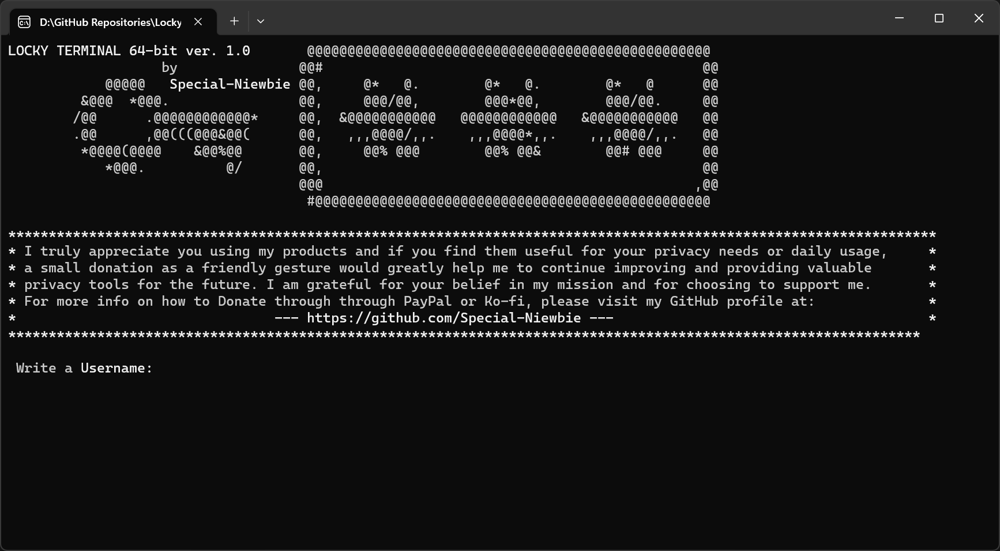
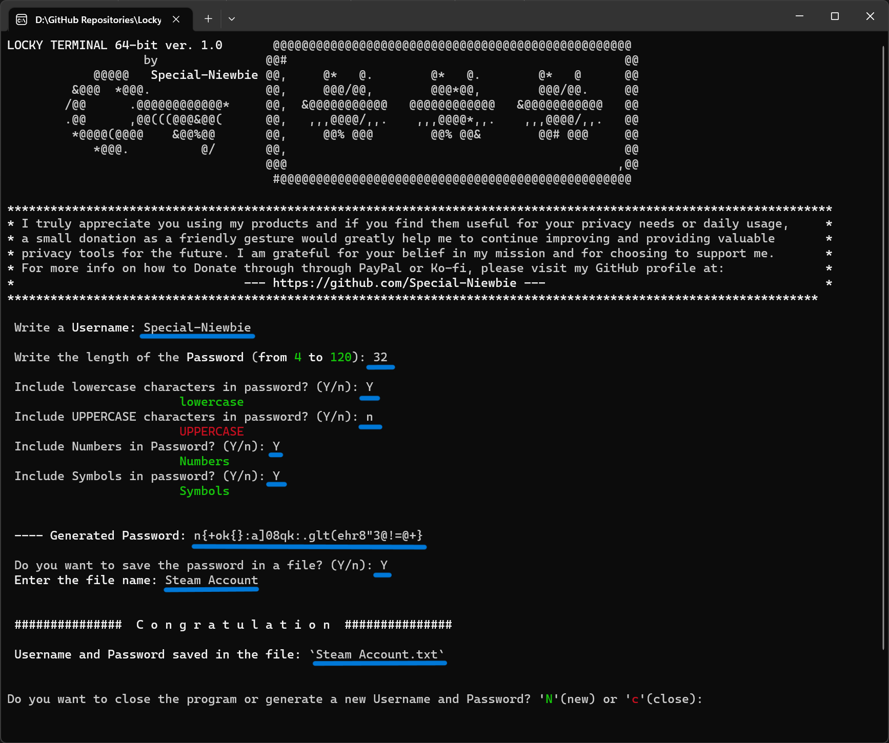
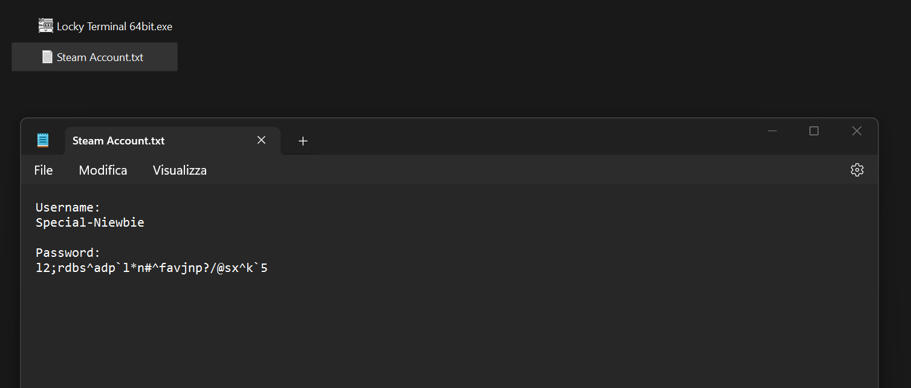

# Locky Terminal 64bit

Locky Terminal 64bit is a command-line program written in C specifically designed for modern 64-bit terminal systems, such as Windows 10, Windows 11, and future versions. It provides an enhanced user experience with color formatting in the terminal while maintaining the same functionality as Locky Terminal 32bit. 

## Donation

PayPal:
 

------------------------------------------------------------------------------

Ko-fi:
 

## Usage

1. Download the program by clicking [here](https://github.com/Special-Niewbie/Locky-Terminal-64-bit/releases/download/1.0.0.0/Locky.Terminal.64bit.exe).
2. Locate the downloaded file named `Locky Terminal 64bit.exe`.
3. Run the `Locky Terminal 64bit.exe` file to launch the program in the terminal.
4. Enter a username when prompted.
5. Specify the desired length of the password within the range of 4 to 120 characters.
6. Choose whether to include lowercase letters, uppercase letters, numbers, and symbols in the password.
7. The program will generate a random password based on the given preferences.
8. Optionally, choose to save the password to a file by entering 'Y' when prompted.
9. If saved, the program will create a file named `<filename>.txt`, where `<filename>` is the name provided by the user.
10. The program will then offer the choice to generate a new username and password or close the program.

## Pictures

1.

2.

3.

## Development Environment

The program was developed using the Dev-C++ IDE, providing a convenient environment for writing and compiling C programs. It is specifically tailored for modern 64-bit terminal systems and operating systems. To ensure compatibility, the `-std=c99` flag was added to the compiler settings. Additionally, the linker option `-static-libgcc` was included to ensure proper linking of the required libraries.

## Contributions

Contributions to the Locky Terminal 64bit program are welcome! If you have any suggestions, bug reports, or feature requests, please feel free to open an issue or submit a pull request on the [GitHub repository](https://github.com/Special-Niewbie/Locky-Terminal-64-bit/issues).

## License

This program is open-source and released under the [GNU General Public License](LICENSE).

